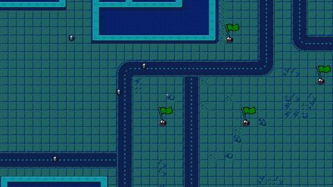

# Artificial Chaos


Artificial Chaos is a 2D top-down game prototype built with [pygame](https://www.pygame.org/). You control the last human still in control of their own mind, freeing mind-controlled soldiers into a following squad while fighting off autonomous combat drones — see [GDD.md](GDD.md) for the full story/design doc.



> **⚠️ Status: unfinished prototype**, not in active development. Core combat and a first-pass win/lose condition now work (see Gameplay below); flag-capture, effects/projectiles, 2 of 6 soldier classes, and 1 of 5 drone types (Centipede) are still unimplemented. It has been migrated onto my shared [`pygame_core`](https://github.com/umutcanekinci/pygame-core) engine (vendored as a git submodule, like [chokepoint](https://github.com/umutcanekinci/chokepoint)): the game loop now extends `pygame_core.Application`, entities are `GameObject`s with `Transform`/`SpriteRenderer2D`/`Animator` components rendered through `pygame_core.Camera`, and asset/spritesheet handling uses `pygame_core` instead of project-local copies.

## Gameplay

Move the squad leader around the map. When you get close to a soldier, they join your army and start following you while spreading out to avoid crowding each other. Hold the left mouse button to fire your sidearm at the nearest drone in range. Recruited soldiers auto-fight nearby drones too. Drones aggro onto the player or squad within range and melee or fire back. Defeat every drone on the map to win; the Squad Leader dying ends the run. Walking leaves a trail of fading footprints, and your rank insignia is shown next to the player. Objective flags pulse on the map but don't do anything yet — see GDD.md's build order for what's next.

### Entities

| Entity                | Sprite                                                             | Behaviour                                                                 |
|-----------------------|----------------------------------------------------------------------|---------------------------------------------------------------------------|
| Squad Leader (player) | `SquadLeader.png`  | WASD/arrow movement with friction; leaves footprints; recruits nearby soldiers; rank insignia shown above; fires a sidearm at the nearest drone in range while the left mouse button is held |
| Soldier               | `Assault-Class.png`, `Sniper-Class.png`, `MachineGunner-Class.png`, `AntiTank-Class.png` | Recruited when the player comes within range, then follows/avoids crowding, and auto-fires at the nearest drone in range instead of following once one's close enough |
| Drone                 | `Scarab.png`, `Spider.png`, `Hornet.png`, `Wasp.png` | Aggros onto the player/squad within range, chases, then melees or fires depending on distance (Hornet/Wasp are ranged-only, no melee); Scarab/Spider hold a destroyed pose before being removed, Hornet/Wasp are removed immediately (no destroyed frame in their sheets) |
| Objective flag        | `objective-flag.png`| Pulsing objective marker, placed from the Tiled map — no gameplay effect yet |

### Controls

| Action               | Input                  |
|----------------------|------------------------|
| Move                 | `W` `A` `S` `D` / Arrow keys |
| Toggle debug overlay | `F1`                   |
| Toggle fullscreen    | `F11`                  |
| Quit                 | `Esc`                  |

## Requirements

- Python 3.10+
- [pygame](https://www.pygame.org/), [pytmx](https://github.com/bitcraft/pytmx)

## Running

```bash
git clone --recurse-submodules https://github.com/umutcanekinci/artifical-chaos.git
cd artifical-chaos
pip install pygame pytmx
python __main__.py
```

If you forgot `--recurse-submodules`: `git submodule update --init` (pulls in the `pygame_core` engine).

## Project layout

```
__main__.py               Entry point — injects src/ + src/pygame_core/ onto sys.path, runs Game()
src/app/game.py           Game (extends pygame_core.Application) — update/draw orchestration
src/gameplay/map.py       Tiled map loader + Obstacle (collision walls)
src/gameplay/camera.py    FollowCamera — pygame_core.Camera plus a follow() helper
src/gameplay/collision.py AABB Collide resolution against the wall list
src/gameplay/animation.py Builds Animator clips from pygame_core.SpriteSheet frames
src/gameplay/combat.py    Shared hitscan combat primitives (find_nearest/ready_to_attack/apply_damage)
src/gameplay/player.py    Player (squad leader) + Footprint; fights with a sidearm
src/gameplay/soldier.py   Recruitable soldiers that follow + auto-fight nearby drones
src/gameplay/robot.py     Drone base class + Scarab/Spider/Hornet/Wasp subclasses (aggro/chase/attack AI)
src/gameplay/flag.py      Objective flags (animated + pulsing marker)
src/util/constants.py     Constants (FPS, render size, sprite sizes, durations, ranks, combat tuning)
src/pygame_core/          Shared engine (git submodule)
assets/                   Images (soldiers, robots, UI), tileset + Tiled map
```

## Credits

Art from [mattwalkden](https://mattwalkden.itch.io/) — released into the public domain under [CC0](https://creativecommons.org/publicdomain/zero/1.0/). A written credit is not required but appreciated.

## Contributing

1. Fork this repository.
2. Clone your fork: `git clone https://github.com/<you>/artifical-chaos.git`
3. Create a branch: `git checkout -b feature/<your-feature>`
4. Commit + push: `git commit -am "<message>" && git push origin feature/<your-feature>`
5. Open a pull request.

## Author

Umutcan Ekinci — [umutcannekinci@gmail.com](mailto:umutcannekinci@gmail.com)

## License

See [LICENSE](LICENSE) (MIT).
